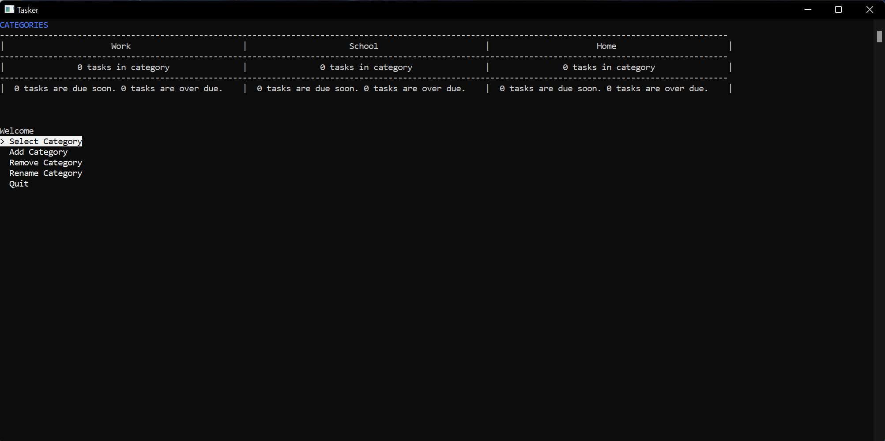
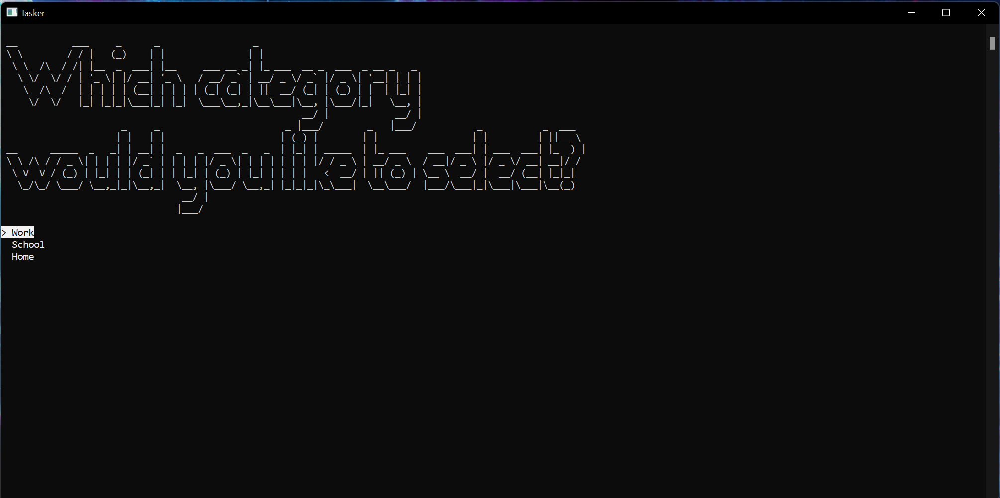
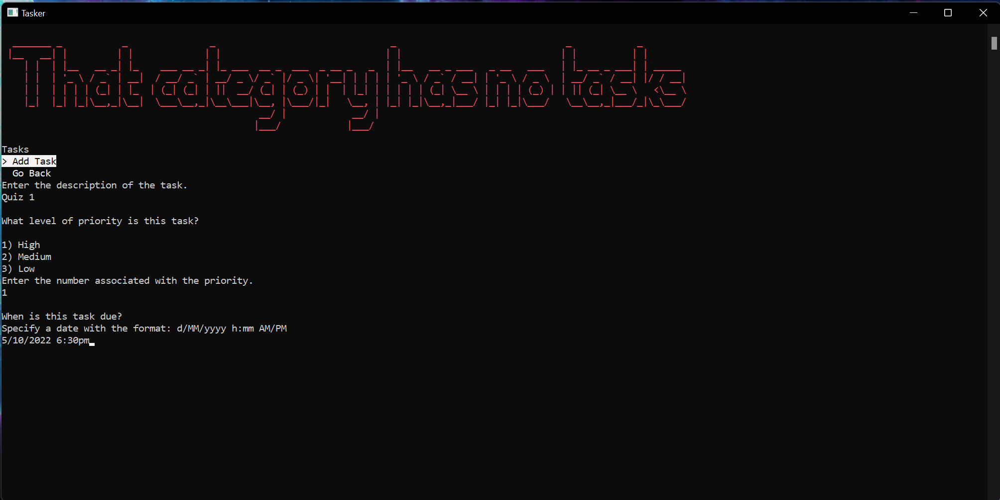
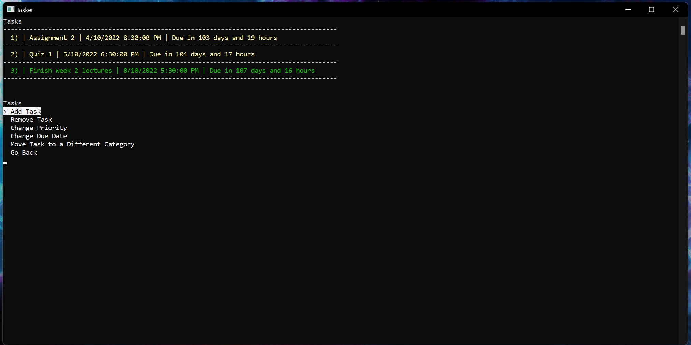

# Reminder Application

## This is a simple console application, it is a basic reminder application for user-defined tasks. The tasks and their respective categories are all customisable. Each category tells the user how many tasks are within them if any are due soon and if any are overdue. The user can set priorities for each task to customise the importance of each task. 

This was first a university project. The task was to re-write poorly written code that barely functioned as expected and was very hard to extend and maintain. Over time I extended it and added new features just so I could learn as much as I could about C#
It’s not a very advanced project but it’s still a good example of what I’ve learned.

### Here's some images of the project running

### This is the main menu once categories have been added.

### This is how a user would select a category

### This is screen a user would see when adding a task.

### This is the main "Task Menu"

